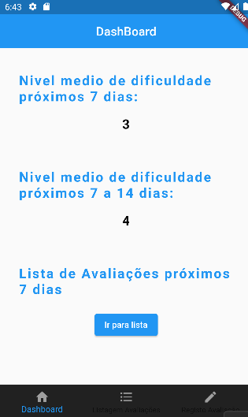
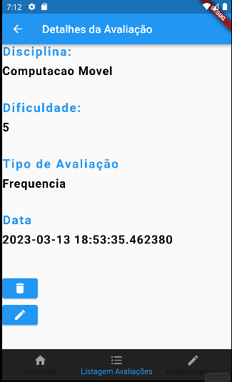
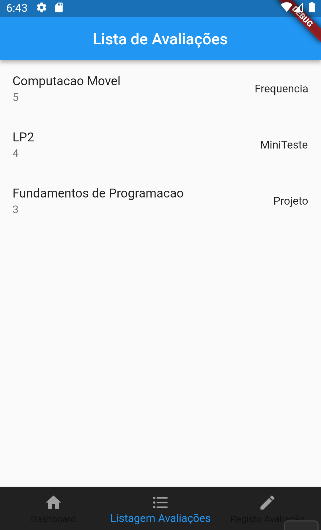
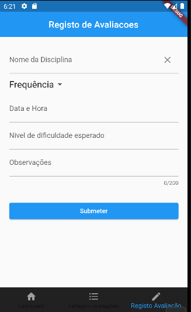

a22107318
Martim Cristóvão

Consegui implementar o menu da aplicação, através do qual se pode navegar entre as várias páginas, 
e consegui implementar todas as paginas, incluindo a pagina dos detalhes, o problema foi a variavel
avaliacoes, a qual nao consigo que seja atualizada após carregar no botao submeter e assim n aparece
nada no ecran, mas se tentarmos com outra lista, aparece tudo bem, implementei também alguns testes.

Nao consegui partilhar o projeto no GitHub pois não aparece a opção "Log in via GitHub" 

Ecrãns:

